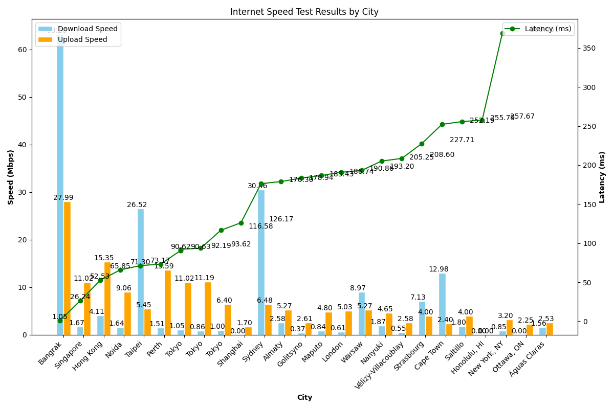

# International Speedtest CLI


The International Speedtest CLI is a command-line tool that allows you to run
speed tests for various cities around the world and visualize the results in a
graph.

## Installation

To install the International Speedtest CLI, follow these steps:

1. Clone the repository:
   ```
   git clone https://github.com/rotkonetworks/intspeed
   ```

2. Change into the project directory:
   ```
   cd intspeed
   ```

3. Run the installation script:
   ```
   ./install.sh
   ```

   This script will copy the necessary executable (`speedtest-go`) to
   `/usr/local/bin`, set the required permissions, create a virtual
   environment, install the required Python dependencies, and make the
   `intspeed.py` script executable.

## Usage

The International Speedtest CLI provides the following commands:

### `intspeed test`

This command runs the speed test for various cities and saves the results to a
`results.json` file. To execute the test, run the following command:

```
intspeed test
```

During the speed test, the tool will display the progress and provide feedback
on each city's test results.

### `intspeed draw`

This command generates a graph from the `results.json` file and saves it as
`speedtest.png`. To draw the graph, run the following command:

```
intspeed draw
```

The graph represents the latency, download speed, and upload speed for each
city tested.

### `intspeed version`

This command displays the version of the International Speedtest CLI. To check
the version, run the following command:

```
intspeed version
```

## License

This project is licensed under the [MIT License](LICENSE).

## Acknowledgements

The International Speedtest CLI utilizes the
[speedtest-go](https://github.com/showwin/speedtest-go) tool for performing the speed
tests.

## Contact

For any inquiries or issues, please contact [Rotko Networks
OU](https://rotko.net).
